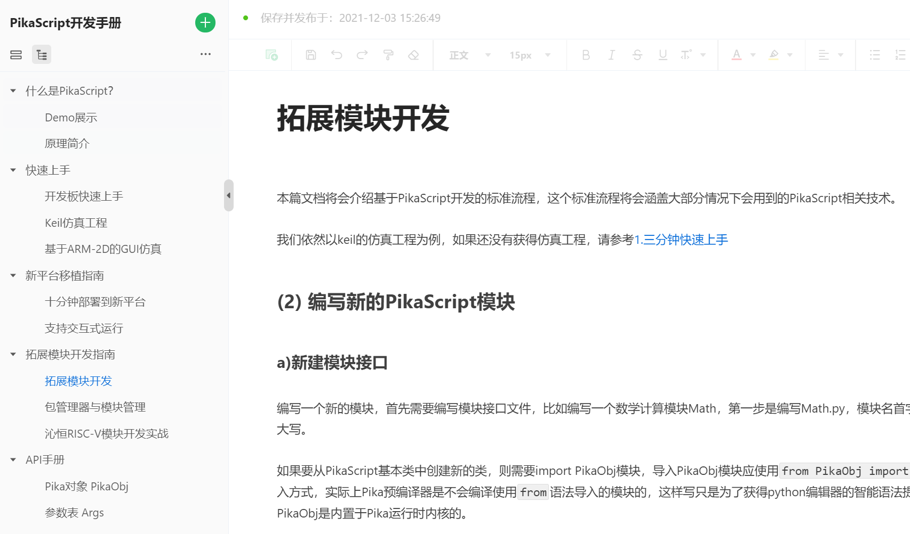
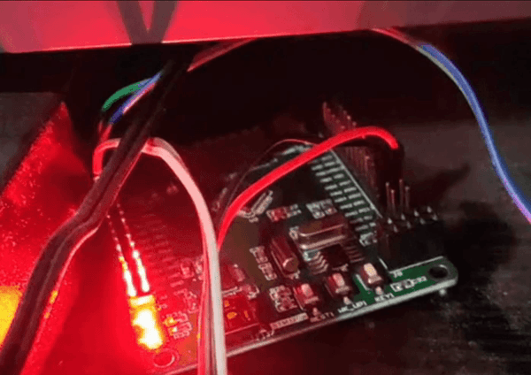
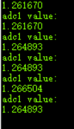
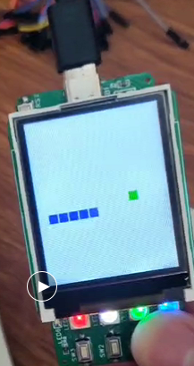
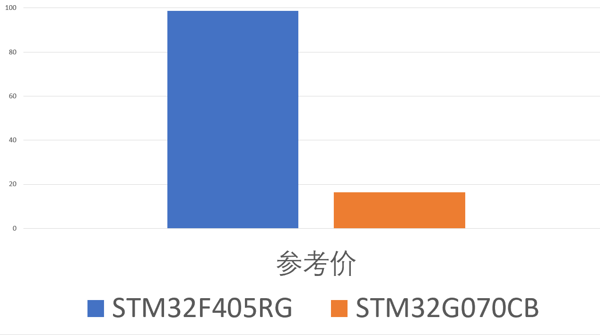

<p align="center">
	
</p>
<h1 align="center" style="margin: 30px 0 30px; font-weight: bold;">PikaScript</h1>
<h4 align="center">跨平台的超轻量级嵌入式 Python 引擎</h4>
<p align="center">
	<a href="https://gitee.com/lyon1998/pikascript/stargazers"></a>
	<a href="https://gitee.com/lyon1998/pikascript/members"></a>
	<a href="https://github.com/pikastech/pikascript/stargazers"></a>
	<a href="https://github.com/pikastech/pikascript/network/members"></a>
	<a href="https://github.com/pikastech/pikascript/blob/master/LICENSE"></a>
        <a href="https://github.com/pikasTech/pikascript/actions/workflows/CI.yml"> </a>
</p>

<p align="center">
	<a href="https://whycan.com/f_55.html" >论坛</a> |
	<a href="https://pikadoc.readthedocs.io/zh/latest/index.html" >文档中心</a> |
	<a href="https://space.bilibili.com/5365336/channel/seriesdetail?sid=1034902">视频</a> |
        <a href="https://item.taobao.com/item.htm?spm=a21dvs.23580594.0.0.52de3d0dt7rqAx&ft=t&id=654947372034">开发板</a> |
        <a href="https://pikadoc.readthedocs.io/zh/latest/%E4%BD%BF%E7%94%A8%20BSP%20%E5%B7%A5%E7%A8%8B.html">BSP</a> |
	<a href="https://pikadoc.readthedocs.io/zh/latest/%E5%8C%85%E7%AE%A1%E7%90%86%E5%99%A8%E4%B8%8E%E6%A8%A1%E5%9D%97%E7%AE%A1%E7%90%86.html">包管理器</a> |
	<a href="https://pikadoc.readthedocs.io/zh/latest/%E4%BB%8E%20RT-Thread%20%E8%BD%AF%E4%BB%B6%E5%8C%85%E5%BC%80%E5%A7%8B.html" >RT-Thread 软件包</a> |
	<a href="https://pikadoc.readthedocs.io/zh/latest/%E5%A6%82%E4%BD%95%E5%8F%82%E4%B8%8E%E7%A4%BE%E5%8C%BA%E8%B4%A1%E7%8C%AE.html" >参与贡献</a> |
	<a href="https://pikadoc.readthedocs.io/zh/latest/%E5%95%86%E4%B8%9A%E5%90%88%E4%BD%9C%E6%96%B9%E5%BC%8F.html">商业合作</a> 
</p>

[](https://pikastech.github.io/pikascript/dev/bench/)


# 1.简介

PikaScript 是一个完全重写的超轻量级 python 引擎，零依赖，零配置，可以在  **Flash ≤ 32KB，RAM≤ 4KB**  的平台下运行(如 stm32g030c8 和 stm32f103c8)，极易部署和扩展，具有大量的中文文档和视频资料。


PikaScript 具有框架式 C 模块开发工具，只要用 Python 写好调用 API ，就能够自动连接到 C 模块，非常方便快捷。不用手动处理任何全局表、宏定义、等等。

所有的工具也是全部开源的，在 tools 目录下。


PikaScript 也支持 MDK、iar、RT-studio 等常见 ide 开发，能够轻松地调试 C 模块。

# 获取 PikaScript:

## 使用在线图形化工程生成器
生成器地址:
http://pikascript.com


## 使用 Pika 包管理器[PikaPackage.exe](https://pikadoc.readthedocs.io/zh/latest/%E5%8C%85%E7%AE%A1%E7%90%86%E5%99%A8%E4%B8%8E%E6%A8%A1%E5%9D%97%E7%AE%A1%E7%90%86.html)

1. 直接运行[PikaPackage.exe](https://gitee.com/Lyon1998/pikascript/attach_files/907478/download), 自动下载并更新pikaScript主仓库(文件在当前磁盘的/tmp/pikaScript文件夹)

2. 将[requestment.txt](/bsp/stm32g030c8/pikascript/requestment.txt)放在[PikaPackage.exe](../../raw/master/tools/pikaPackageManager/pikaPackage.exe)同一文件夹下, 运行[pikaPackage.exe](../../raw/master/tools/pikaPackageManager/pikaPackage.exe), 自动在当前目录下安装[内核](../../tree/master/src)、[预编译器](../../tree/master/tools/pikaCompiler)与[模块](../../tree/master/package)。

3. 已发布的模块列表：[packages.toml](/packages.toml)

# 快速上手

可使用[仿真工程](document/1.三分钟快速上手.md)快速上手，无需硬件，也可以使用官方支持的开发板[Pika派—Zero](https://item.taobao.com/item.htm?spm=a2126o.success.result.1.76224831Y0X1gO&id=654947372034)，上手即玩。

[Pika派python编程游玩指南](https://pikadoc.readthedocs.io/zh/latest/Pika%20%E6%B4%BE%E5%BC%80%E5%8F%91%E6%9D%BF%E5%BF%AB%E9%80%9F%E4%B8%8A%E6%89%8B.html)

[](https://item.taobao.com/item.htm?spm=a2126o.success.result.1.76224831Y0X1gO&id=654947372034)

开发板基于 STM32G030C8T6 小资源 MCU，仅 64kB Flash，8kB RAM 即可运行完整解释器，和完整的外设驱动（GPIO、TIME、IIC、UART、ADC、PWM、RGB、KEY、LCD）。板载 CH340 USB 转串口芯片，Type-C 接口，支持串口下载 python 脚本，板载4颗 RGB 灯，可选配[LCD屏幕](https://item.taobao.com/item.htm?spm=a1z10.3-c.w4002-23991764791.12.16f97c58fsLjVk&id=660745643102)。

# 开发手册

### [点此进入文档中心](https://pikadoc.readthedocs.io/zh/latest/index.html)



# 视频教程

### [点此进入视频中心](https://space.bilibili.com/5365336/channel/seriesdetail?sid=1034902)


# 交流论坛

### [点此进入论坛](https://whycan.com/f_55.html)


## 文件目录
[src](../../tree/master/src) - 内核源码

[bsp](../../tree/master/bsp) - 裸机芯片/板卡支持

[port](../../tree/master/port) - 操作系统支持

[document](../../tree/master/document) - 开发文档

[examples](../../tree/master/examples) - 示例脚本

[package](../../tree/master/package) - 模块目录

[pikaCompiler](../../tree/master/tools/pikaCompiler) - 使用 rust 编写的预编译器

[pikaPackageManager](../../tree/master/tools/pikaPackageManager) - 使用 go 编写的模块管理器

# 2.平台支持列表

## MCU support
|MCU|bsp|gpio|uart|pwm|adc|i2c|
|---|---|---|---|---|---|---|
|stm32g030c8|√|√|√|√|√|√|
|stm32g070cB|√|√|√|√|√|√|
|stm32f103c8|√|√|√|√|√|√|
|stm32f103rb|√|√|√|√|√|√|
|stm32f103ze|√|√|√|√|√|√|
|stm32f103rc|√|√|√|√|√|√|
|stm32f401cc|√|√|√|√|√|√|
|stm32f411ce|√|√|√|√|√|√|
|stm32f407ze|√| | | | | |
|stm32f407zg|√| | | | | |
|stm32h750vb|√| | | | | |
|stm32f051r8|√| | | | | |
|ch582|√|√|√| |√|√|
|ch32v103r8t6|√|√| | | | |
|cm32m101a|√| | | | | |
|w801|√| | | | | |
|w806|√|√|√|√|√|√|
|apm32f030r8|√| | | | | |
|apm32e103vb|√| | | | | |
|bl-706|√| | | | | |
|Raspberry Pico|√| | | | | |
|ESP32C3|√| | | | | |
|TC264D|√| | | | | |
|devc|√| | | | | |
|EC600N|√| | | | | |

## Board support
|Board|bsp|gpio|uart|pwm|adc|i2c|rgb|lcd|arm-2d|
|---|---|---|---|---|---|---|---|---|---|
|[Pika-Pi-Zero](https://item.taobao.com/item.htm?spm=a230r.1.14.1.4f2e27a8R0qWJn&id=654947372034&ns=1&abbucket=15#detail)|√|√|√|√|√|√|√|√|√|

|Board|bsp|arm-2d|
|---|---|---|
|QEMU-arm2d|√|√|

|Board|bsp|LED|KEY|
|---|---|---|---|
|SmartLoong|√|√|√|√|

## OS support

|OS|port|GPIO|TIME|PWM|
|---|---|---|---|---|
|RT-Thread|√|√|√|√|
|vsf|√|√| | |

|OS|port|Google Test|Benchmark|
|---|---|---|---|
|linux|√|√|√|

## 相关开源项目 
### PikaScript Bluepill Demo In PlatformIO — Python-like REPL 🐍🔌
https://github.com/maxgerhardt/pikascript-pio-bluepill

# 3.特性
### (1)运行环境

支持裸机运行，可运行于 **RAM ≥ 4kB** ，**FLASH ≥ 32kB** 的mcu中，如stm32g030, stm32f103c8t6，esp8266。

### (2)开发环境
支持串口下载 Python 脚本。

<br/>

支持 Keil、IAR、rt-thread studio、segger embedded studio 等IDE开发。

支持 CMake、makeFile、Scons 等构建工具

零依赖，零配置，开箱即用，极易集成进已有的C工程。

极易拓展自定义的C原生函数。

支持跨平台，可在 linux 环境开发内核。

### (3)语法特性

使用 python3 标准语法的子集。

在编译时支持 python 类和方法定义，完整支持封装、继承、多态、模块功能 - 基于 [Pika 预编译器](../../tree/master/tools/pikaCompiler)。

在运行时支持 python 方法调用、变量定义、对象构造、对象释放、控制流(if\while) - 基于 [Pika 运行时内核](../../tree/master/src/package/pikascript/pikascript-core)。

|语法|编译时|运行时|Shell|
|---|---|---|---|
|模块定义   |√|-|-|
|模块导入   |√|√|√|
|类定义    |√|√|√|
|类继承    |√|√|√|
|方法定义   |√|√|√|
|方法重载   |√|√|√|
|方法调用   |√|√|√|
|参数定义   |√|√|√|
|参数赋值   |√|√|√|
|对象新建   |√|√|√|
|对象销毁   |√|√|√|
|对象嵌套   |√|√|√|
|控制流     |√|√|√|

#### 操作符

| + | - | * | / | == | > | < | >= | <= | % | ** | // | != | & | >> | << | and | or | not | += | -= | *= | /= |
|---|---|---|---|---|---|---|---|---|---|---|---|---|---|---|---|---|---|---|---|---|---|---|
|√|√|√|√|√|√|√|√|√|√|√|√|√|√|√|√|√|√|√|√|√|√|√|

#### 控制流

| if | while | for | else | elif | break | continue |
| --- | --- | --- | --- | --- | --- | --- |
|√|√|√|√|√|√|√|

#### 数据结构

| string | list | dict |
| --- | --- | --- |
|√|√|√|

### (4)源码规范

注重源码可读性，命名规范，标准统一，完全不使用宏，几乎不使用全局变量。

完整的 googletest 单元测试。

# 4.交流与技术支持：

## Tencent QQ Group:

<br/>

## Tencent QQ： 
645275593

## E-mail: 
645275593@qq.com


# 5.Demo展示

## Demo 01 GPIO

``` python
import PikaStdLib
import STM32G0

mem = PikaStdLib.MemChecker()
io1 = STM32G0.GPIO()
time = STM32G0.Time()

io1.init()
io1.setPin('PA8')
io1.setMode('out')
io1.enable()
io1.low()

print('hello pikascript')
print('mem.max :')
mem.max()
print('mem.now :')
mem.now()

while True:
    io1.low()
    time.sleep_ms(500)
    io1.high()
    time.sleep_ms(500)

```



## Demo 02 USART

``` python
import PikaStdLib
import STM32G0

time = STM32G0.Time()
uart = STM32G0.UART()
uart.init()
uart.setId(1)
uart.setBaudRate(115200)
uart.enable()

while True:
    time.sleep_ms(500)
    readBuff = uart.read(2)
    print('read 2 char:')
    print(readBuff)

```


## Demo 03 ADC

``` python
import PikaStdLib
import STM32G0

time = STM32G0.Time()
adc1 = STM32G0.ADC()

adc1.init()
adc1.setPin('PA1')
adc1.enable()

while True:
    val = adc1.read()
    print('adc1 value:')
    print(val)
    time.sleep_ms(500)

```




## Demo 04 PWM output

``` python
import PikaStdLib
import STM32G0

time = STM32G0.Time()
pwm = STM32G0.PWM()
pwm.setPin('PA8')
pwm.setFrequency(2000)
pwm.setDuty(0.5)
pwm.enable()

while True:
    time.sleep_ms(500)
    pwm.setDuty(0.5)
    time.sleep_ms(500)
    pwm.setDuty(0.001)
    
```

## Demo 05 RGB

``` python
import STM32G0
import PikaPiZero
import PikaStdLib

rgb = PikaPiZero.RGB()
mem = PikaStdLib.MemChecker()

rgb.init()
rgb.enable()

print('hello 2')
print('mem used max:')
mem.max()

while True:
    print('flowing')
    rgb.flow()

```

## Demo 06 Snake(Need LCD)

``` python
from PikaObj import *
import PikaStdLib
import PikaPiZero
import STM32G0

# hardware init
lcd = PikaPiZero.LCD()
lcd.init()
lcd.clear('white')
key = PikaPiZero.KEY()
key.init()
time = STM32G0.Time()
x_max = 120
y_max = 150

# snake init
s = PikaPiZero.Point()
w = 9
h = 9
s.x = 50
s.y = 10
len = 0
while len < 3:
    b = s
    i = 0
    while i < len:
        b = b.next
        i = i + 1
    b.next = PikaPiZero.Point()
    b.next.x = b.x - 10
    b.next.y = b.y
    b.next.prev = b
    len = len + 1
# ring link
b.next = s
s.prev = b

i = 0
b = s
while i < len:
    lcd.fill(b.x, b.y, w, h, 'blue')
    b = b.next
    i = i + 1

print('snake lengh')
print(len)

# fruit init
f = PikaPiZero.Point()
f.x = 30
f.y = 20
lcd.fill(f.x, f.y, w, h, 'green')

# memory check
mem = PikaStdLib.MemChecker()
print('mem used max:')
mem.max()

# main loop
d = 0
isUpdate = 1
isEat = 0
while True:
    if isUpdate:
        # isUpdate = 0
        # check eat fruit
        if f.x == s.x and f.y == s.y:
            # have eat fruit
            isEat = 1
            f.x = f.x + 30
            if f.x > x_max:
                f.x = f.x - x_max
            f.y = f.y + 30
            if f.y > y_max:
                f.y = f.y - y_max
            lcd.fill(f.x, f.y, w, h, 'green')
        # move snake by the direction
        if d == 0:
            x_new = s.x + 10
            y_new = s.y
            if x_new > x_max:
                x_new = 0
        elif d == 1:
            x_new = s.x
            y_new = s.y - 10
            if y_new < 0:
                y_new = y_max
        elif d == 2:
            x_new = s.x
            y_new = s.y + 10
            if y_new > y_max:
                y_new = 0
        elif d == 3:
            x_new = s.x - 10
            y_new = s.y
            if x_new < 0:
                x_new = x_max
        if isEat:
            isEat = 0
            b_new = PikaPiZero.Point()
            b_new.x = x_new
            b_new.y = y_new
            b_new.prev = s.prev
            b_new.next = s
            s.prev.next = b_new
            s.prev = b_new
            s = b_new
            len = len + 1
            print('snake lengh')
            print(len)
            print('mem used max:')
            mem.max()
        # drow the snake and fruit
        # clear last body
        lcd.fill(s.prev.x, s.prev.y, w, h, 'white')
        # new body
        s.prev.x = x_new
        s.prev.y = y_new
        # head is last body
        s = s.prev
        lcd.fill(s.x, s.y, w, h, 'blue')
        b = s
        i = 0
    # scan key
    key_val = key.get()
    if key_val == 0:
        d = 0
        isUpdate = 1
    elif key_val == 1:
        d = 1
        isUpdate = 1
    elif key_val == 2:
        d = 2
        isUpdate = 1
    elif key_val == 3:
        d = 3
        isUpdate = 1

```



这几个 Demo 占用的 RAM 最大值只有3.56K，把1K的堆栈也算上就是4.56K，Flash 最大占用是30.4K，以 STM32F103C8T6 的 20K RAM 和 64K Flash 为标准，RAM 才用掉不到25%，Flash 才用掉不到50%。

我们可以简单对比一下 micropython 的常用芯片 STM32F405RG 和这次跑 PikaScript 的芯片STM32G070CB

## RAM资源对比


## Flash资源对比


## 参考价对比(以2021年9月11日立创商城10片售价为参考）


## 拓展能力如何呢？

除了设备驱动之外，为 mcu 开发自定义的 python 脚本绑定在 pikascript 的开发框架下非常轻松，下面两个 Demo 就是自定义的C模块拓展，这个 Demo 基于 ARM-2D 图像驱动库开发了一些 python 脚本接口。

## 几个小方块~


## 几个旋转太阳~


# 6.内核测试与开发

## 在 Docker 中测试 (recommend)
[ Docker 开发环境搭建指南 ](https://pikadoc.readthedocs.io/zh/latest/get-start_linux.html)

# 7.贡献者
| 内容 | 贡献者 |
| --- | --- |
| Add [CMSIS-PACK](https://pikadoc.readthedocs.io/zh/latest/get-start_cmsis-pack.html) | [GorgonMeducer](https://github.com/GorgonMeducer) |
| 捐赠：air32f103 开发板 * 20 | 合宙 [xinxi204](https://gitee.com/xinxi204) |
| contrubute to PikaMath.Math() | [onceday](https://gitee.com/onceday) |
| add support for Unix Time | [onceday](https://gitee.com/onceday) |
| contrubute to PikaStdLib.String() | [purewind7](https://gitee.com/purewind7) |
| Add [PLOOC](https://github.com/GorgonMeducer/PLOOC) support for PikaScript Core | [GorgonMeducer](https://github.com/GorgonMeducer) |
| 定向赞助：500¥ (ctypes 相关） | 蒋太平 |
| fix linux install script | [Maximilian Gerhardt](https://github.com/maxgerhardt) |
| ch582 package | [梦程MI](https://gitee.com/dreamcmi) |
| ch582 BSP | [梦程MI](https://gitee.com/dreamcmi) |
| 捐赠：EC600X QuecPython 开发板 | 移远通信 武加玉 |
| Performance Point: 900->1400 | [GorgonMeducer](https://github.com/GorgonMeducer) |
| stm32f051r8 BSP |[unsigned](https://gitee.com/unsigned0)|
| stm32f407ze BSP |[unsigned](https://gitee.com/unsigned0)|
| devc BSP |[unsigned](https://gitee.com/unsigned0)|
| TC264D BSP |[unsigned](https://gitee.com/unsigned0)|
| PikaVM 优化 | [GorgonMeducer](https://github.com/GorgonMeducer) |
| W801Device package | 刘延(微信名) |
| W806 bsp | 刘延(微信名) |
| 捐赠：ESP32C3 5pic，调试器 |启明云端 沧御|
| 捐赠：LS1C101芯片10pic, LS1c101开发板，调试器|龙芯俱乐部 石南|
| PikaVSF OS package | [versaloon](https://github.com/versaloon) |
| ESP32C3 BSP |沧御|
| 捐赠：ESP32开发板、墨水屏*4 | name(微信名) |
| 捐赠：智龙开发板 | 龙芯俱乐部 石南 |
| package/STM32F1 | [sjy](https://gitee.com/shanjiayang) |
| package/STM32F103RBBooter | [sjy](https://gitee.com/shanjiayang) |
| bsp/stm32f103rb | [sjy](https://gitee.com/shanjiayang) |
| 基于 QEMU 的 ARM-2D 仿真工程 | [liuduanfei](https://github.com/liuduanfei) |
| 捐赠：GD32E103TB 芯片2片 | 信息牛(微信名) |
| Rt-thread 支持包、适配层、模块| [Meco Jianting Man](https://github.com/mysterywolf) |
| 捐赠：移远 EC600S-CN 4G模块 | 移远模块 |
| 捐赠：博流 BL706 开发板|博流智能 [bouffalolab](https://github.com/bouffalolab)|
| 捐赠：中国移动 CM32M101A 开发板| 孟巍(微信名) |
| 捐赠：APM32F030R8 开发板 | 极海半导体 陈成 |
| 捐赠：APM32E103VB 开发板 | 极海半导体 陈成 |
| 捐赠：APEX-Link 仿真器 | 极海半导体 陈成 |
| 源码格式化，增加 git 属性文件 | [Meco Jianting Man](https://github.com/mysterywolf) |
| demo/simulation-keil | 千帆(微信名) |
| demo/stm32f103zet6/demo01-led-stm32f103zet6 | [甜航](https://github.com/easyzoom) |
| demo/stm32f103zet6/demo02-led-stm32f103zet6_tworoot | [甜航](https://github.com/easyzoom) |
| demo/stm32f407zgt/demo01-led-stm32f407vgt | [甜航](https://github.com/easyzoom) |